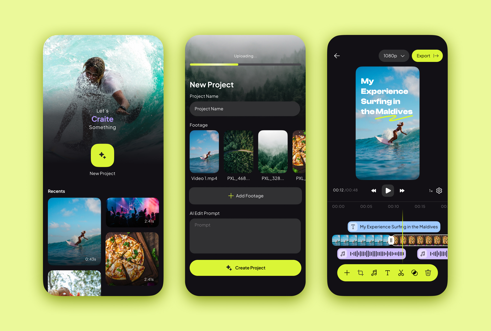

# Craite App
Craite is an Android app powered by Gemini that automatically edits videos based on your vision making content creation effortless and time-saving.


Users start by creating a project where they can select multiple videos alongside a prompt and optionally add an audio track. These files are then uploaded to Firebase Cloud Storage, where a Python Flask backend server processes them. Once uploaded, the Flask server retrieves the media files and user’s prompt from Firebase and sends them to the Gemini API. The Gemini API generates a comprehensive set of edit settings, including timestamps for trimming, video effects (such as zoom-in, zoom-out, and rotation), adjustments (brightness, contrast, saturation, etc.), optional text overlays, captions, and audio edits to ensure synchronization with the video. Gemini utilizes the provided context to deliver edit settings that align with the user’s vision and preferences. These settings are then stored in Firestore, from where they are fetched, parsed, and applied by the app. Users can finally export the edited video with all the enhancements seamlessly integrated.
They can easily share their moments in a more engaging way without the need to spam others with multiple videos. Craite empowers anyone to create high-quality content, regardless of editing experience.

## Building and Running this App
**It is worth noting this app works alongside it's [backend server](https://github.com/Idadelveloper/craite-flask-backend-server/) to process videos so make sure you setup and run your own backend server alongside this app**

### Prerequisites
1. **Android Studio:** Download and install the latest version of Android Studio from https://developer.android.com/studio.
2. **Firebase Project:** Create a Firebase project in the Firebase console (https://console.firebase.google.com/ ).
3. **Firebase Authentication:**
    - In your Firebase project settings, navigate to the Authentication section.
    - Enable the Anonymous sign-in method.
4. **google-services.json:**
    - Download the `google-services.json` file from your Firebase project settings and place it in the app module directory of your Android project.

### Steps to Run (Android app)
1. Clone this repository:
   ```bash
   git clone https://github.com/Idadelveloper/craite/
   ```
2. **Open the Project in Android Studio:** Open the project in Android Studio by navigating to the project directory.
3. **Sync Project with Gradle Files:** Android Studio will automatically sync the project with the Gradle files. If it doesn't, click **Sync Project with Gradle Files** in the toolbar.
4. **Build the App:** Click **Build** -> **Make Project** to build the app.
5. **Run the App:**
    - Connect an Android device or start an emulator.
    - Click **Run** -> **Run 'app'** to run the app on the selected device or emulator.

## Building and Running the Flask backend Server
1. **Python 3.7 or higher:** Download and install from https://www.python.org/ .
2. **Virtual Environment (Recommended):** Create a virtual environment to manage dependencies:
```bash
python3 -m venv venv
source venv/bin/activate
```
3. **Firebase Project:** Set up a Firebase project with:
    - Firebase Authentication (with Anonymous sign-in enabled)
    - Firebase Storage (for storing media files)
    - Firebase Firestore (for storing prompt data and Gemini responses)
      **Google Cloud Project:** Create a Google Cloud project and enable the Gemini API.
    - Obtain API Key and set it as an environment variable.
    - You can also get a Gemini API key from Google AI Studio (https://ai.google.dev/aistudio)
    - Create a service account with necessary permissions and download its JSON credentials file.
4. **Required Libraries:** Install the necessary Python packages:
```bash
pip install -r requirements.txt
```

### Steps to Run
1. **Clone the Repository:** Clone the project from GitHub:
```bash
git clone https://github.com/Idadelveloper/craite-flask-backend-server
```
2. **Set Up Environment Variables:**
    - Create a file named .env in the project root directory.
    - Use the provided example.env as a template and fill in the values:
```
GOOGLE_API_KEY=your_gemini_api_key
GOOGLE_APPLICATION_CREDENTIALS=creds/your_service_account_file
```
- Place the downloaded Firebase credentials JSON file in the `creds` directory.
3. **Activate Virtual Environment:**
```bash
source venv/bin/activate
```
4. **Run the Flask App:**
```bash
flask run
```
- The app will typically run on `http://127.0.0.1:5000/`.

### Linking the Frontend to the Backend
In the `NewProjectViewModel` of the app, got to the `sendPromptDataToFirestore` method and add your base url
```kotlin
val baseUrl = "your_backend_server_base_url_here"
```


## Contributors
- [Ida Delphine](https://x.com/idadelveloper)
- [Nui Lewis](https://x.com/nuilewis)